<div align="center">

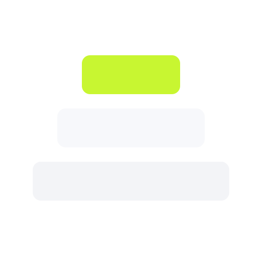

# Strata

**A fast personal document workspace. Write in a calm editor, nest pages as deep as you think, and turn any one of them into a public link.**

Next.js App Router · Convex · Clerk · BlockNote · Tailwind · Motion

</div>

<br />

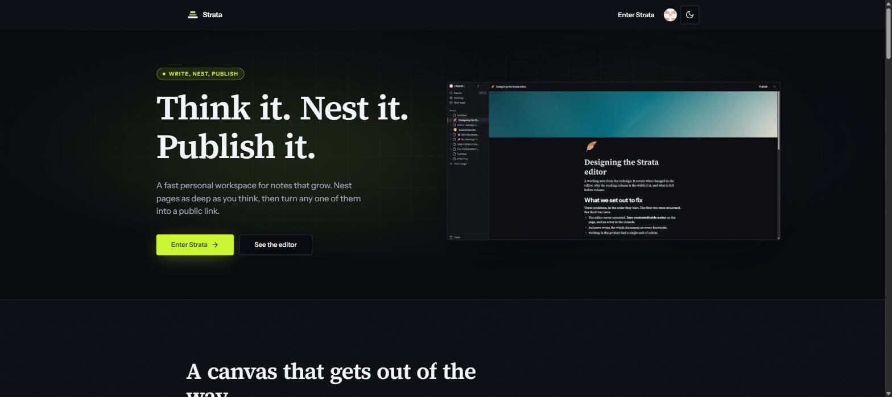

<br />

## Contents

- [What it is](#what-it-is)
- [Features](#features)
  - [Write](#write)
  - [Nest](#nest)
  - [Publish](#publish)
  - [Find](#find)
  - [Recover](#recover)
  - [Theme](#theme)
- [Design system](#design-system)
- [Accessibility](#accessibility)
- [Architecture](#architecture)
- [Routes](#routes)
- [Data model](#data-model)
- [Running it locally](#running-it-locally)
- [Environment variables](#environment-variables)
- [Scripts](#scripts)
- [Known limitations](#known-limitations)

<br />

## What it is

Strata is a personal knowledge workspace in the shape of a document editor. You create pages,
pages hold other pages, and any page can be given a public URL that anyone can read without an
account.

The name comes from the one thing it does that matters most: **layers**. Every page can contain
more pages, with no depth limit, and the sidebar tree makes that structure the primary way you
move around.

Three ideas drive the design:

1. **The canvas is the quietest surface in the product.** Body text is set in a serif at a
   measured column of roughly 68 characters. No motion, no chrome, no colour competing with your
   words.
2. **Identity lives in the chrome.** The volt lime accent, the aurora, the kinetic type and the
   scroll-driven carousel all live on the marketing page and the app frame, never on the page
   you are writing on.
3. **Nothing is irreversible by accident.** Deleting moves to a Trash you can search. Removing
   for good takes a second, explicitly different step.

<br />

## Features

### Write

A full block editor built on [BlockNote](https://www.blocknotejs.org). Press `/` anywhere to
insert a block. Everything autosaves to Convex, debounced so a long document is not rewritten on
every keystroke.

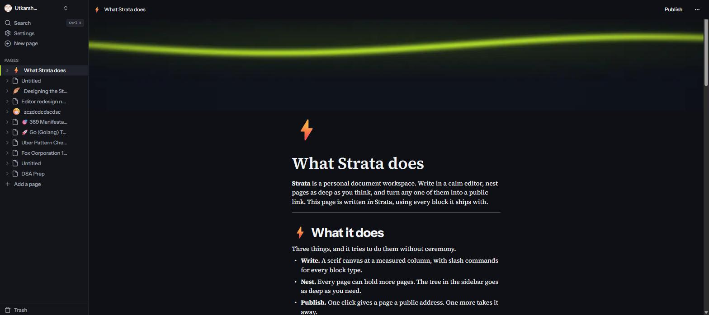

Supported blocks: paragraph, three heading levels, bullet / numbered / check / toggle lists,
quote, code block with syntax highlighting, table, divider, image, video, audio and file.
Inline: **bold**, *italic*, underline, strikethrough, `code`, and links.

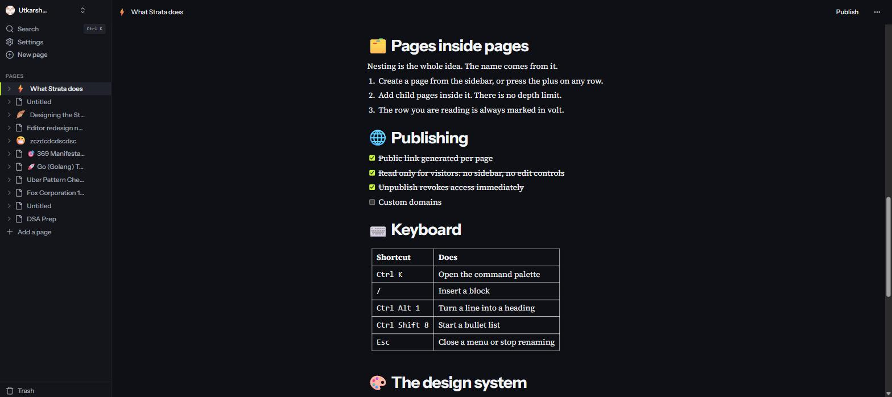

The slash menu groups blocks by kind and shows the keyboard shortcut for each one.

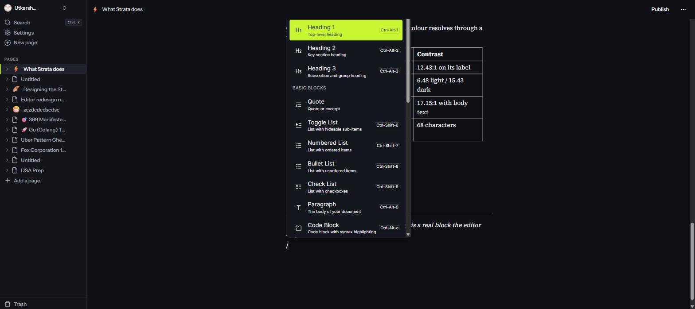

**Page furniture.** Every page can carry a cover image and an emoji icon. Both are optional and
both are revealed on hover so they stay out of the way while you write. Covers upload through
EdgeStore; icons come from a searchable emoji picker and appear in the sidebar, the breadcrumb
and the browser tab.

### Nest

Pages contain pages, as deep as you like. The sidebar renders the tree recursively with
expand and collapse per row, and the page you are reading is always marked with a volt bar that
slides between rows as you navigate.

Each row reveals two actions on hover, both reachable by keyboard: `···` to move the page to the
Trash, and `+` to create a child page inside it.

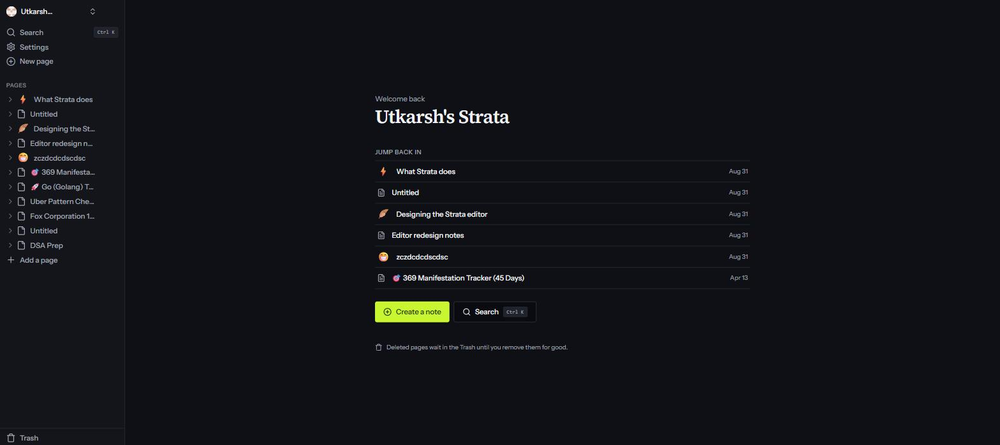

### Publish

Any page can be given a public address. Visitors get a read-only render with no sidebar, no
editing controls and no account requirement. Unpublishing revokes access immediately.

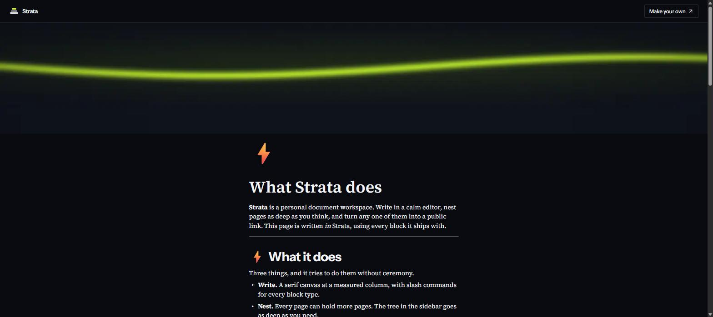

The backend enforces this rather than the UI: `documents.getById` returns a document to an
anonymous caller only when it is published and not archived.

### Find

`Ctrl K` (or `Cmd K`) opens a command palette over the whole workspace. It lists your four most
recent pages first, then everything else, with page icons and keyboard hints.

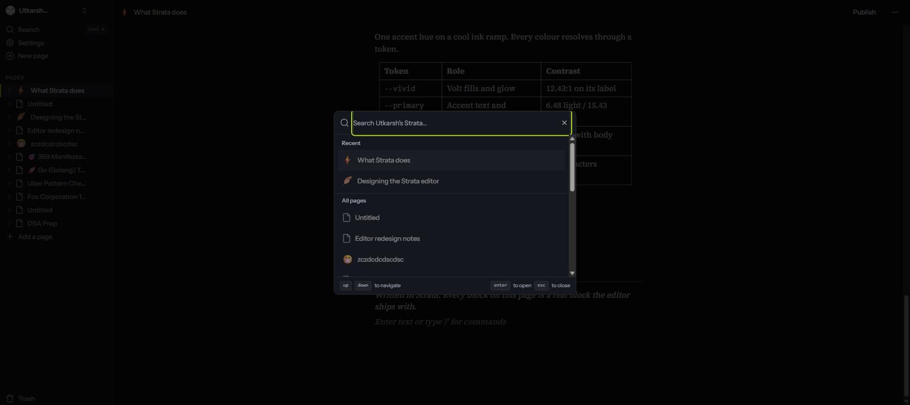

### Recover

Deleted pages go to a Trash that is bounded, scrollable and searchable. Because most pages end
up called "Untitled", each row shows a preview line pulled from the page body plus its creation
date, so you can tell rows apart.

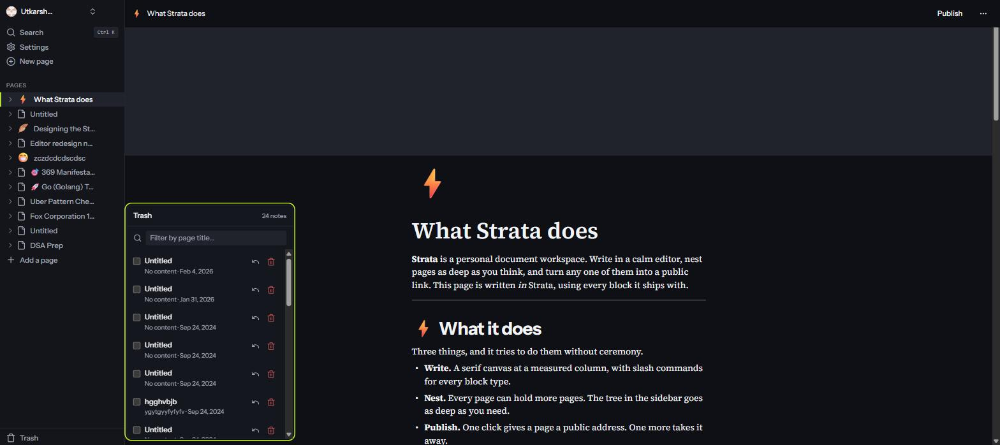

Restore is a quiet action. Permanent delete is coloured destructive, sits apart from restore,
and opens a confirmation that names the page it is about to remove. Multi-select allows bulk
deletion behind the same confirmation.

### Theme

Light, dark or follow the system, applied as a class on `<html>` and remembered per device.

<p>
  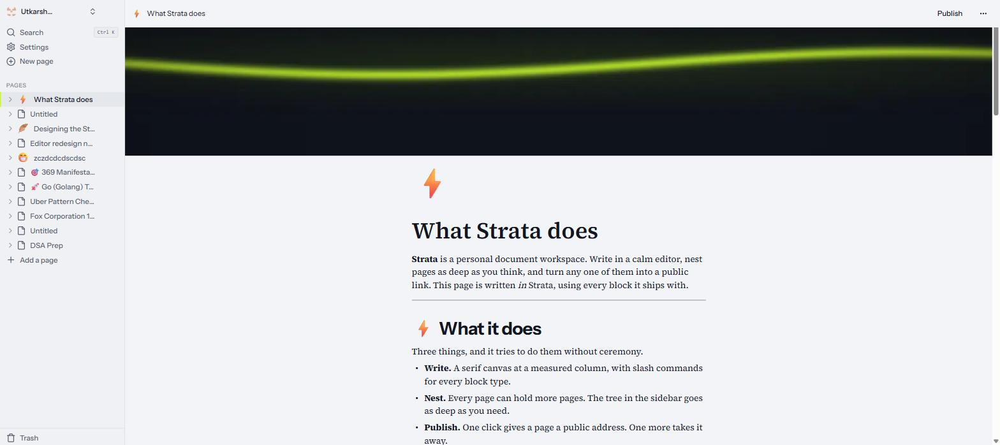
  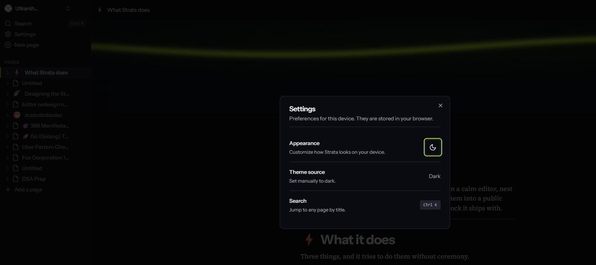
</p>

<br />

## Design system

One accent hue on a cool blue-black ink ramp. Every colour in the product resolves through a
CSS custom property; there are no hardcoded hex values or raw Tailwind palette classes anywhere
in `app/` or `components/`.

| Token | Role | Light | Dark |
| --- | --- | --- | --- |
| `--background` | Canvas | `220 28% 98%` | `225 22% 5%` |
| `--foreground` | Body text | `226 28% 10%` | `220 20% 96%` |
| `--shell` | App chrome | `220 24% 96%` | `226 20% 7%` |
| `--secondary` | Sidebar rail | `220 20% 95%` | `226 17% 9%` |
| `--primary` | Accent text, icons, markers | `82 78% 22%` | `74 88% 62%` |
| `--vivid` | Volt fills and glow | `74 92% 58%` | `74 92% 58%` |
| `--destructive` | Irreversible actions | `358 68% 44%` | `358 84% 68%` |
| `--doc-column` | Reading measure | `42rem` | `42rem` |

**The vivid rule.** `--vivid` is the bright lime. It measures **1.19:1** against a light
background, so it is never a bare marker, border or text colour on a light surface. It is only
ever a fill with `--vivid-foreground` on top (12.43:1, passes anywhere), a marker on a dark
surface (15.62:1), or a decorative glow that carries no meaning. Accent text and markers use
`--primary`, which is tuned per mode.

**Type.** Two families. [Instrument Sans](https://fonts.google.com/specimen/Instrument+Sans) for
chrome, headings and marketing; [Source Serif 4](https://fonts.google.com/specimen/Source+Serif+4)
for the document canvas. Code uses the system mono stack, so there is no third webfont.

**Shape.** 4px radius for rows, inputs, buttons and cards. 10px for overlay surfaces (popover,
dropdown, dialog). Nothing is a pill.

**Motion.** Scroll progress, a drifting aurora, kinetic headlines, a magnetic primary CTA,
spotlight cards, parallax, one marquee, and a pinned horizontal carousel driven by scroll.

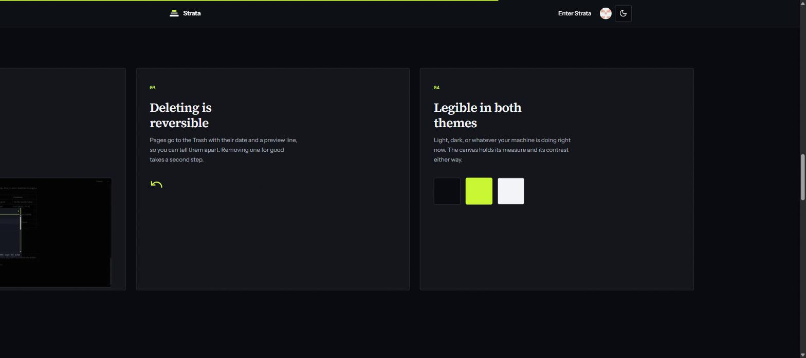

All of it lives on the marketing page and the app frame. The editor canvas gets none of it.

<br />

## Accessibility

Treated as a gate, not a feature.

- **44 of 44 token pairs pass WCAG AA** in both themes, verified against the shipped values.
- **Every control is keyboard reachable.** The page tree, its hover-only row actions, the
  collapse control and the resize handle are real buttons with labels, not click-handled divs.
  Arrow keys expand and collapse tree rows.
- **Visible focus** everywhere except the writing surface, where the caret is the indicator.
- **`prefers-reduced-motion` is honoured throughout.** Looping and scroll-driven animation stops,
  the carousel degrades to a native horizontal scroller, and entrance animations collapse to
  their end state. Content is never invisible because an animation did not run: that end state is
  guaranteed in CSS, not left to the JavaScript animation layer.

Add `?motion=on` to any URL to force motion regardless of the OS setting, or `?motion=off` to
force it off. Useful for capturing stills and for demos. Without the parameter the user's
preference always wins.

<br />

## Architecture

```
app/
├─ (marketing)/            public landing page and legal routes
│  ├─ _components/         hero, sections, motion primitives, logo, footer
│  └─ (routes)/            privacy, terms
├─ (main)/                 the authenticated workspace
│  ├─ _components/         sidebar navigation, tree item, trash, navbar, publish
│  └─ (routes)/documents/  index and [documentId]
├─ (public)/               the unauthenticated published view
│  └─ (routes)/preview/    [documentId]
└─ api/edgestore/          file upload handler

components/                editor, toolbar, cover, palette, modals, shadcn/ui primitives
convex/                    schema and server functions
hooks/                     zustand stores and small client hooks
```

**Rendering.** Server Components by default. Anything using Motion, pointer physics or scroll
listeners is an isolated `"use client"` leaf. The editor is loaded with `next/dynamic` and
`ssr: false`, since BlockNote needs the DOM.

**Motion.** [Motion](https://motion.dev) only, via `motion/react`. No GSAP, so nothing competes
for the same frames. Continuous values (pointer position, scroll progress) are driven with
`useMotionValue` and `useTransform` so the React tree never re-renders during a gesture.

<br />

## Routes

| Route | Access | Rendering | What it is |
| --- | --- | --- | --- |
| `/` | Public | Static | Landing page |
| `/privacy` | Public | Static | Privacy policy |
| `/terms` | Public | Static | Terms and conditions |
| `/documents` | Authenticated | Dynamic | Workspace index with recents |
| `/documents/[documentId]` | Authenticated | Dynamic | The editor |
| `/preview/[documentId]` | Public, per document | Dynamic | Published read-only view |

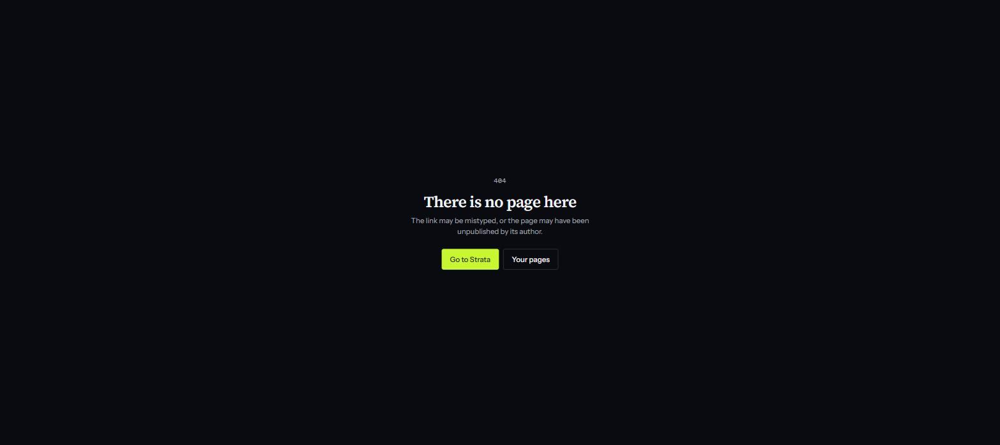

Missing pages, unpublished links and render failures all get designed states with a route back,
rather than a raw error.

<br />

## Data model

A single Convex table.

```ts
documents: defineTable({
  title:          v.string(),
  userId:         v.string(),
  isArchived:     v.boolean(),
  parentDocument: v.optional(v.id("documents")),   // the nesting
  content:        v.optional(v.string()),          // BlockNote JSON
  coverImage:     v.optional(v.string()),
  icon:           v.optional(v.string()),
  isPublished:    v.boolean(),
})
  .index("by_user", ["userId"])
  .index("by_user_parent", ["userId", "parentDocument"])
```

Nesting is `parentDocument` pointing at another row. Archiving cascades to children; restoring
checks that the parent is still live before un-archiving. Every query and mutation verifies
`userId` against the Clerk identity, except the published-document path.

<br />

## Running it locally

**Prerequisites:** Node 18 or newer, plus accounts on [Convex](https://convex.dev),
[Clerk](https://clerk.com) and [EdgeStore](https://edgestore.dev). All three have free tiers.

```bash
git clone https://github.com/UTKARSH17102000/Notion_Clone.git
cd Notion_Clone/notion-clone
npm install
```

Create `notion-clone/.env` with the variables below, then in two terminals:

```bash
npx convex dev     # pushes the schema and functions, keeps them in sync
npm run dev        # http://localhost:3000
```

**Clerk setup.** Create a JWT template named exactly `convex`. Copy its issuer URL into
`convex/auth.config.js` as `domain`, with `applicationID: "convex"`. A mismatch here is the
usual cause of the app hanging on its loading spinner.

<br />

## Environment variables

`.env` is gitignored. Never commit it.

| Variable | Where it comes from |
| --- | --- |
| `NEXT_PUBLIC_CONVEX_URL` | Convex dashboard, deployment URL |
| `CONVEX_DEPLOYMENT` | Written by `npx convex dev` |
| `NEXT_PUBLIC_CLERK_PUBLISHABLE_KEY` | Clerk dashboard, API keys |
| `CLERK_SECRET_KEY` | Clerk dashboard, API keys |
| `EDGE_STORE_ACCESS_KEY` | EdgeStore dashboard |
| `EDGE_STORE_SECRET_KEY` | EdgeStore dashboard |

<br />

## Scripts

| Command | Does |
| --- | --- |
| `npm run dev` | Development server on port 3000 |
| `npm run build` | Production build |
| `npm run start` | Serve the production build |
| `npm run lint` | ESLint |
| `npx convex dev` | Sync Convex schema and functions |

<br />

## Known limitations

Stated plainly rather than left for you to discover.

- **No offline support.** The editor needs a live connection to save.
- **No collaborative editing.** BlockNote supports Yjs, but it is not wired up here. One writer
  per document.
- **No full-text search.** The command palette matches on page titles only, not body content.
- **Trash has no retention policy.** Pages stay until you delete them by hand.
- **Cover images are not cleaned up** from EdgeStore when a page is permanently deleted.
- **Mobile is implemented but lightly tested.** The sidebar collapses and overlays below 768px.

<br />

<div align="center">

Built by [Utkarsh Goswami](https://github.com/UTKARSH17102000)

</div>
